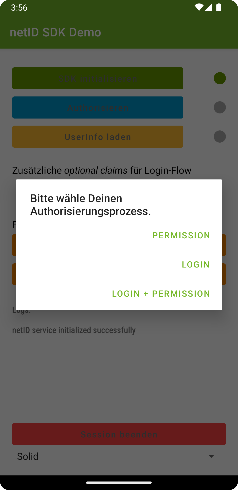
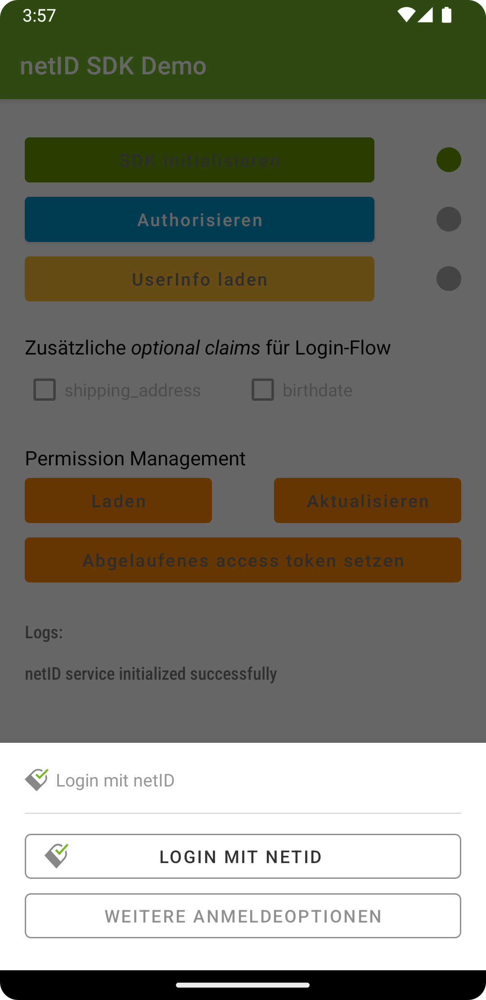

# netID MobileSDK for Android

## About

The `netID MobileSDK` facilitates the use of the [netID](https://netid.de) authorization and privacy management services.
Alongside the SDK, this repository hosts two sample apps, demonstarting the usage of the SDK. The first one is more complete as it demonstrates complete workflows including fetching/setting of additional values and/or user information. The second one is less complex and only demonstrates the basic workflow, if you want to add the different buttons for interacting with the SDK in a more direct way. 

## Initialize NetIDService

The `NetIdService` is the main interface to communicate with the netID SDK. It handles all the communication with the backend services and provides UI elements for the authorization flow.

First, construct a configuration object of type NetIdConfig for the NetIDService:
```kotlin
private lateinit var netIdConfig: NetIdConfig

companion object {
    private const val clientId = "XXXXXXXX-XXXX-XXXX-XXXX-XXXXXXXXXXXX"
    private const val redirectUri = "https://eunid.github.io/redirectApp"
    private const val claims = "{\"userinfo\":{\"email\": {\"essential\": true}, \"email_verified\": {\"essential\": true}}}"
    private val permissionLayerConfig = null
    private val loginLayerConfig = null
}
...

netIdConfig = NetIdConfig(clientID, redirectUri, claims, permissionLayerConfig, loginLayerConfig)
```

The parameters have the following meaning:
| Parameter | Description |
| :- | :- |
| clientId | The client id of your application. You can retrieve it from the netID Developer portal. This parameter is mandatory. |
| redirectUri | An URI that is used by your application to catch callbacks. You can retrieve it from the netID Developer portal. This parameter is mandatory. |
| claims | An OIDC-compliant, URL-encoded JSON string, denoting additional claims that should be set during authorization. Can be null. |
| permissionLayerConfig | A set of strings, that can be used to customize the appearance of the layer for the permission flow. Can be null. |
| loginLayerConfig | A set of strings, that can be used to customize the appearance of the layer for the login flow. Can be null. |

Besides the `clientId`, the `redirectUri` is the most important parameter in the configuration. The `redirectUri` is a link that is called by the authorization service to get back to your app once the authorization process has finished. As this is a rather crucial process, the netID SDK makes use of Verified App Links to ensure proper and secure communication between the authorization service and your app. 
In order to make app links work, you have to provide a link in the form of an uri (e.g. https://eunid.github.io/redirectApp) and host a special file named `assetlinks.json` on that very same domain (in this example https://eunid.github.io/.well-known/assetlinks.json).
When using `Android Studio` for development, there is an extra section inside the menu `Tools` called `App Links Assistant` to help create and test app links for you application as well as the corresponding asset file.

To make your application trigger on the aforementioned redirect, you must include the following snippet in your app's `AndroidManifest.xml`:
```xml
<activity
    android:name="net.openid.appauth.RedirectUriReceiverActivity"
    tools:node="replace"
    android:exported="true">
    <intent-filter android:autoVerify="true">
        <action android:name="android.intent.action.VIEW" />
        <category android:name="android.intent.category.DEFAULT" />
        <category android:name="android.intent.category.BROWSABLE" />
        <data android:scheme="https"
            android:host="eunid.github.io"
            android:path="/redirectApp"/>
    </intent-filter>
</activity>
```
However, for your own application you have to make sure that `scheme`, `host`, and `path` match your very own settings.

To learn more about Verified App Links, see the corresponding documentation [here](https://developer.android.com/training/app-links/verify-android-applinks).

After setting up your application in the correct way and constructing the configuration object, register your application as a listener to receive all callbacks made by the `NetIdService`.
```kotlin
NetIdService.addListener(this)
```

Finally, initialize the NetIdService itself with the aforementioned configuration.
```kotlin
NetIdService.initialize(netIdConfig, this.applicationContext)
```

## Authorization

After the NetIDService has been initialized, subsequent calls to request authorization can be made. 
In the example app, you are presented with three choices as can be seen in this screenshot.



In your own app, you most likely will decide which flow to take without an user interaction. To initiate the authorization process, issue the following call to the NetIDService:
```kotlin
NetIdService.getAuthorizationFragment(this, authFlow, forceApp2App)
```
| Parameter | Description |
| :-        |    :-   |
| activity | The activity to attach this fragment to. This parameter is mandatory. |
| authFlow | Type of flow to use, can be either ``NetIdAuthFlow.Permission``, ``NetIdAuthFlow.Login`` or ``NetIdAuthFlow.LoginPermission``. This parameter is mandatory. |
| forceApp2App | If set to true, will yield an ``NetIdError`` if the are no Account Provider apps installed. Otherwise, will use app2web flow automatically. Defaults to ``false``. |

You have to provide an instance of you app's activity so that the SDK can display a view for the authorization process itself.
With the parameter `authFlow`you decide, if you want to use `Permission`, `Login` or `Login + Permission` as authorization flow.
The optional parameter `forceApp2App` decides, if your app wants to use app2app only. If let alone, this parameter defaults to `false` meaning that if no Account Provider apps are installed, the SDK will automatically fall back to app2web flow. If set to `true` and no Account Provider apps are installed, this call will fail with an error.

Depending on the chosen flow, different views are presented to the user to decide on how to proceed with the authorization process.

<table>
    <tr>
        <th>Login Flow with no Account Provider Apps</th>
        <th>Permission Flow with no Account Provider Apps</th>
    </tr>
    <tr>
        <td width=50%>
            <p><em>Login flow without installed id apps</em></p></img>
        </td>
        <td width=50%>
            <p><em>Permission flow without installed id apps</em></p></img>
        </td>
    </tr>
</table>

As stated above, it is possible to customize certain aspects of the dialog presented for authorization. For example, the strings displayed during the login process could be changed with this configuration:
```kotlin
private val loginLayerConfig = LoginLayerConfig("Headline text", "Login with app %s", "Continue text")
``` 

The SDK will figure out by itself, if Account Provider apps like [GMX](https://play.google.com/store/apps/details?id=de.gmx.mobile.android.mail) or [web.de](https://play.google.com/store/apps/details?id=de.web.mobile.android.mail) are installed. If so, the SDK will always prefer the app2app-flow instead of app2web when communicating with the netID authorization service. When at least one of those apps is found, the call to `getAuthorizationFragment` will return a slightly different layout, exposing the found apps:
<table>
    <tr>
        <td>
            <p><em>Login flow with multiple Account Provider Apps</em></p>
        </td>
        <td>
            <p><em>Permission flow with multiple Account Provider Apps / expanded choice menu - Default is to pre-select one App and collapse choice menu</em></p>  
        </td>
    </tr>
    <tr>
        <td width=50%>
            <p><em>Login flow with installed id apps</em></p></img>
        </td>
        <td width=50%>
            <p><em>Permission flow with installed id apps</em></p></img>
        </td>
    </tr>
</table>

If the user did decide on how to proceed with the login process (e.g. which Account Provider provider to use), a redirect to actually execute the authorization is called automatically.

As can be seen from above screenshots, ui elements are organzied in layers to ease the authorization process. The SDK supports two different graphical styles, called ``Solid`` and ``Outline``. Switching between those two styles can be done in the demo app by using the picker element at the end of the screen. Programatically you can change the style by calling:

```kotlin
 NetIdService.setLayerStyle(style)
```

## Session persistence
The SDK implements session persistence. So if a user has been authorized successfully, this state stays persistent even when closing and reopening the app again.

To test this with the demo app, close the app once you are successfully authorized. Then, open the app again. After pressing the `SDK initialisieren`-button, your session will be restored and you are again authorized. So there will be no need to press `Authorisieren` again.

To get rid of the current session, `NetIdService.endsession()` has to be called explicitly. In the demo app, this is done by pressing `Session beenden`. Note, that this will delete the current session within the App only

## Using the authorized service

Subsequent calls now can be made to use different aspects of the service.


```kotlin
NetIdService.endSession()
```
Use this call to end a session. On the listener `onEndSession` is called signaling success of the operation. All objects regarding authorization (e.g. tokens) will get discarded. However, the service itself will still be available. A new call to `getAuthorizationFragment` will trigger a new authorization process.

```kotlin
NetIdService.fetchUserInfo(this.applicationContext)
```
Fetches the user information object. On success `onFetchUserInfo` is called on the delegate, returning the requested information. Otherwise `onFetchUserInfoWithError` gets called, returning a description of the error.

```kotlin
NetIdService.fetchPermissions(this.applicationContext)
```
Fetches the permissions object. On success `onFetchPermissions` is called on the delegate, returning the requested information. Otherwise `onFetchPermissionsWithError` gets called, returning a description of the error.

```kotlin
NetIdService.updatePermissions(this.applicationContext)
```
Updates the permissions object. On success `onUpdatePermissions` is called on the delegate, returning the requested information. Otherwise `onUpdatePermissionsWithError` gets called, returning a description of the error.


## Button workflow

As stated in the beginning, there is another way to interact with the SDK. In the so called <i>button workflow</i> you can decide to not use the preconfigured forms and texts but build your very own dialogs.

Therefore, the SDK gives you the opportunity to only make use of the basic functionalities to use the SDK. As a starting point, take a look at the second demo app provided in the `buttonApp` folder. Just like in the demo app, there is a possibility to change between different design sets to show off the different styles for the buttons. This can be done by calling the following function:

```kotlin
NetIdService.setButtonStyle(style)
```
And ``style`` can be any style provided by ``NetIdButtonStyle``.

<table>
    <tr>
        <th>Style SolidWhite</th>
        <th>Style SolidGreen</th>
        <th>Style Outline</th>
    </tr>
    <tr>
        <td width=30%>
            
        </td>
        <td width=30%>
            
        </td>
        <td width=30%>
            
        </td>
    </tr>
</table>

Of course, at first you have to initialize the SDK as in the example above.
```kotlin
val netIdConfig = NetIdConfig(
    clientId = clientId,
    redirectUri = redirectUri,
    claims = claims,
    promptWeb = "consent",
    permissionLayerConfig = permissionLayerConfig,
    loginLayerConfig = loginLayerConfig
)
NetIdService.addListener(this)
NetIdService.initialize(netIdConfig, this)
```

Then, just request the buttons you need to trigger your desired auth flow. E.g. for the permission flow:

```kotlin
val permissionContinueButton = NetIdService.permissionContinueButtonFragment("")
supportFragmentManager.commit {
    setReorderingAllowed(true)
    add(R.id.activityMainPermissionContainer, permissionContinueButton)
}
```
With the optional parameter ``continueText``it is possible to alter the default text to a more personal liking. If set to an empty string or omitted completely, a default will be used.

Note that if any Account Provider apps are installed, there will be the possibility to choose which one to use (triggering app2app flow). For example, to display a button for each installed app, use this code:

```kotlin
NetIdService.getKeysForAccountProviderApps().forEach {
    val appButton = NetIdService.accountProviderAppButtonFragment(it, NetIdAuthFlow.Permission, it)
    supportFragmentManager.commit {
        setReorderingAllowed(true)
        add(R.id.activityMainPermissionContainer, appButton)
    }
}
```
Again, using the optional parameter ``continuteText`` will alter the text on the button - otherwise all buttons will have the standard text displayed.

For the login and/or login+permission flow, you can request a button to initiate app2web authorization with the following call:

```kotlin
val loginContinueButton = NetIdService.loginContinueButtonFragment("", NetIdAuthFlow.Login)
supportFragmentManager.commit {
    setReorderingAllowed(true)
    add(R.id.activityMainLoginContainer, loginContinueButton)
}
```

And if you prefer app2app, you can request respective buttons for each Account Provider this way:

```kotlin
NetIdService.getKeysForAccountProviderApps().forEach {
    val appButton = NetIdService.accountProviderAppButtonFragment(it, NetIdAuthFlow.Login, it)
    supportFragmentManager.commit {
        setReorderingAllowed(true)
        add(R.id.activityMainLoginContainer, appButton)
    }
}
```
